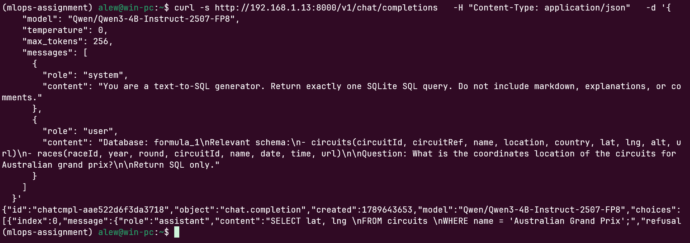
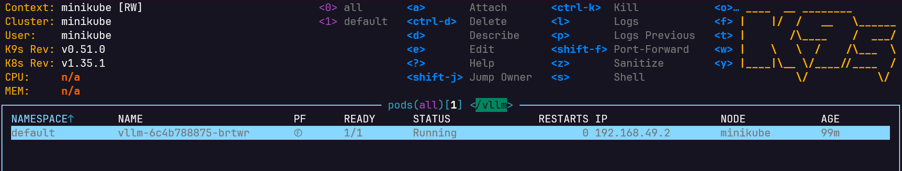
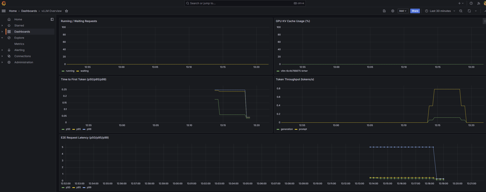
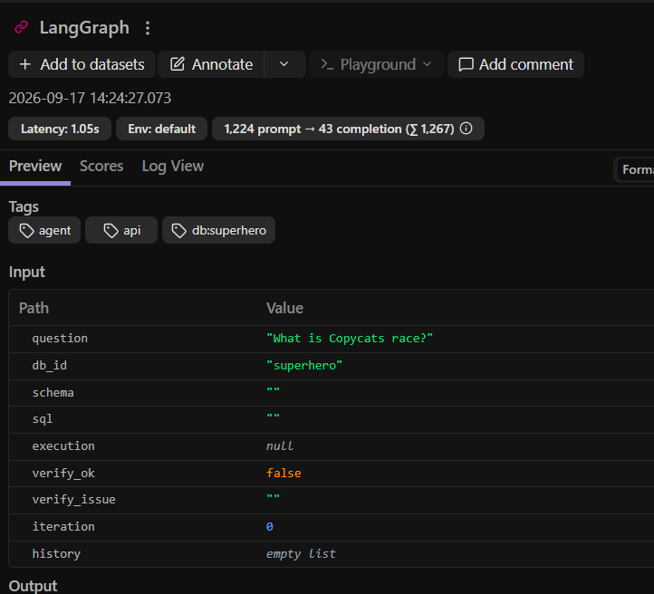
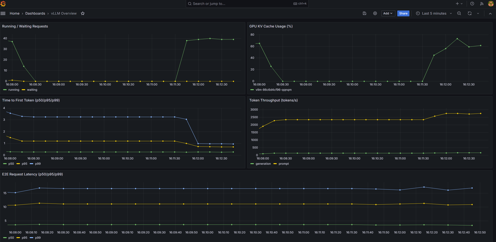
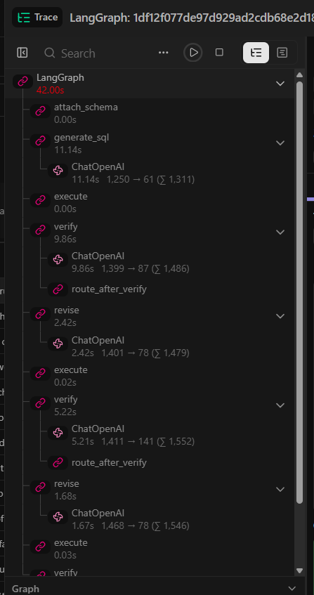
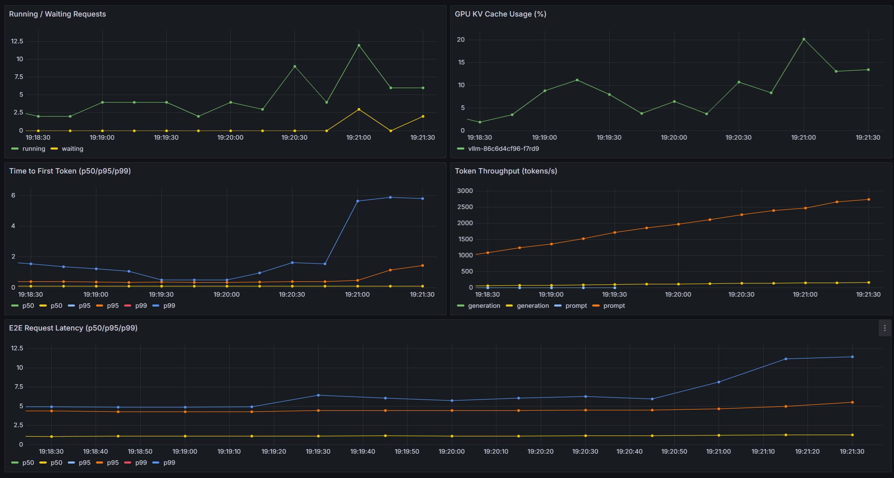
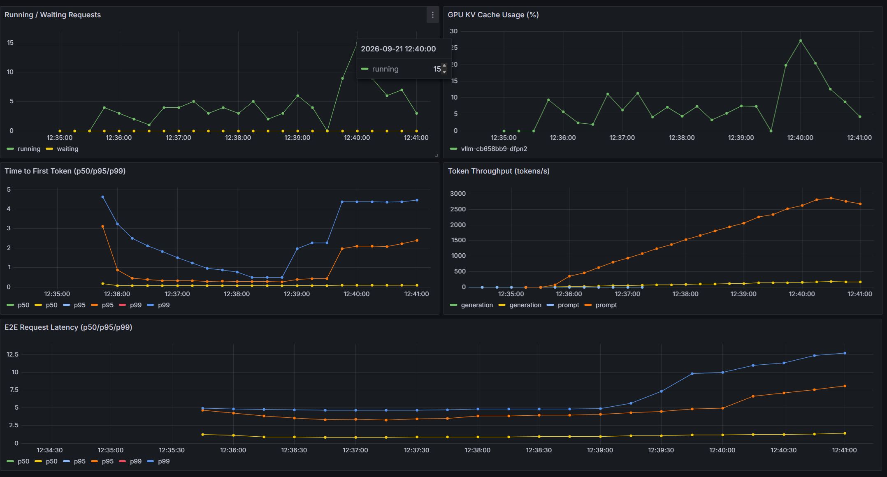
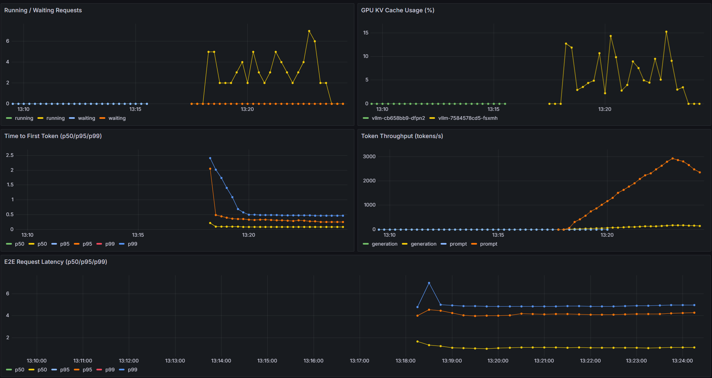
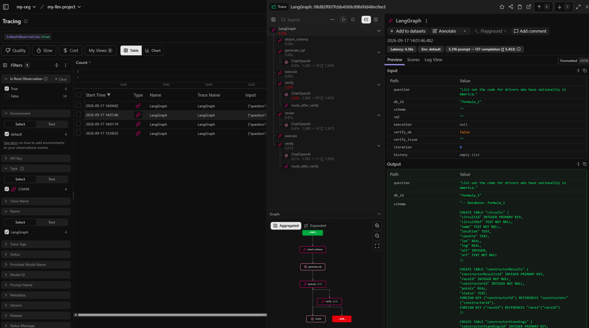

# Report

## Serving Configuration (Phase 1)

```shell
# Used as a starting point for K8s Pod
vllm serve Qwen/Qwen3-4B-Instruct-2507-FP8 --port 8000 --trust-remote-code --max-model-len 32768 --enable-chunked-prefill --max-num-batched-tokens 1024
```

- `--trust-remote-code` - trusts the custom Python code shipped with the model
- `--max-model-len 32768` - caps the maximum context length, lowering GPU memory usage
- `--enable-chunked-prefill` - instead of processing one big prompt in a single pass, vLLM splits it into multiple chunks, so long prompts don't block short generations from making progress
- `--max-num-batched-tokens 1024` - caps the total number of tokens processed in a single scheduler iteration. With chunked prefill enabled, this is the main lever for balancing throughput vs. latency

Manual sanity check against the running endpoint, confirming the model loads and returns sensible SQL:



The vLLM pod running on the cluster:



---

## Observability (Phase 2 & 4)

The Grafana dashboard covers latency, throughput, and KV cache headroom, and visibly reacts to load:



Langfuse captures every agent run as a nested trace (`generate_sql` → `execute` → `verify` → `revise`), tagged with metadata used for filtering in later phases:



---

## SLOs

**Target**: P95 end-to-end agent latency under 5 seconds, 10+ RPS (1 RPS = 1 full agent run per second) over a 5-minute window.

### Iteration 0

On the first iteration the SLO wasn't hit - and not only was it missed, the agent began to crash after about 20 seconds at 10 RPS. Sometimes it even took down the whole cluster, due to the combined CPU/GPU load from vLLM, Langfuse (and its underlying workloads, such as ClickHouse), and the agent process itself.



```log
INFO:     127.0.0.1:38008 - "POST /answer HTTP/1.1" 200 OK
INFO:     127.0.0.1:38170 - "POST /answer HTTP/1.1" 200 OK
INFO:     127.0.0.1:38374 - "POST /answer HTTP/1.1" 200 OK
INFO:     127.0.0.1:38410 - "POST /answer HTTP/1.1" 200 OK
INFO:     127.0.0.1:60678 - "POST /answer HTTP/1.1" 200 OK
INFO:     127.0.0.1:60702 - "POST /answer HTTP/1.1" 200 OK
INFO:     127.0.0.1:38158 - "POST /answer HTTP/1.1" 200 OK
INFO:     127.0.0.1:37996 - "POST /answer HTTP/1.1" 200 OK
INFO:     127.0.0.1:60726 - "POST /answer HTTP/1.1" 200 OK
INFO:     127.0.0.1:38032 - "POST /answer HTTP/1.1" 200 OK
INFO:     127.0.0.1:60740 - "POST /answer HTTP/1.1" 200 OK
INFO:     127.0.0.1:38074 - "POST /answer HTTP/1.1" 200 OK
INFO:     127.0.0.1:60690 - "POST /answer HTTP/1.1" 200 OK
INFO:     Shutting down
INFO:     Waiting for connections to close. (CTRL+C to force quit)
INFO:     Waiting for background tasks to complete. (CTRL+C to force quit)
```

### Iteration 1

Just for the sake of this lab (since I don't have a separate VM with an H100 GPU), I lowered the RPS to 1 - otherwise my whole setup just crashes.

**Optimization Parameters**: `--max-model-len 32768 --enable-chunked-prefill --max-num-batched-tokens 1024`

```json
{
  "requested_rps": 1.0,
  "duration_seconds": 300,
  "wall_clock_seconds": 360.02877819299465,
  "total_requests": 300,
  "achieved_rps": 0.8332667224706798,
  "ok": 285,
  "timeouts": 0,
  "http_errors": 0,
  "client_errors": 15,
  "latency_p50": 2.36193562799599,
  "latency_p95": 18.41356498299865,
  "latency_p99": 40.80446903296979,
  "latency_max": 108.32684229401639
}
```

Looking at the Langfuse trace for a single request, most of the time is spent waiting for vLLM to return an answer. Therefore we need to optimize vLLM and/or how it's being queried:



Grafana during the iteration 1 load test:



### Iteration 2

Let's change the parameters like so:

**Optimization Parameters**: `--max-model-len 4096 --enable-prefix-caching --gpu-memory-utilization 0.9 --max-num-batched-tokens 4096 --max-num-seqs 64`

- `--max-model-len 4096` - lowering this value can allow the model to fit more KV caches in GPU memory
- `--enable-prefix-caching` - allows for prefixes to be cached and used from cache instead of computing them again
- `--gpu-memory-utilization 0.9` - tells vLLM to pre-allocate up to 90% of GPU memory
- `--max-num-batched-tokens 4096` - Caps tokens processed per scheduler step; higher value raises throughput but adds per-request latency
- `--max-num-seqs 64` - Limits concurrent in-flight sequences to avoid overcommitting GPU/KV cache

Result:
```json
{
  "requested_rps": 1.0,
  "duration_seconds": 300,
  "wall_clock_seconds": 347.4572116610361,
  "total_requests": 300,
  "achieved_rps": 0.8634156665387239,
  "ok": 283,
  "timeouts": 2,
  "http_errors": 0,
  "client_errors": 15,
  "latency_p50": 3.3251205009873956,
  "latency_p95": 26.99964486301178,
  "latency_p99": 42.623024174012244,
  "latency_max": 100.14663059503073
}
```



The resulting load test had similar results (even slightly worse).

### Iteration 3

Next thing to try:

- `--max-num-seqs 256` - max concurrent sequences per batch. Raising this increases throughput (better GPU utilization) but can hurt per-request latency since more requests compete for compute
- `--max-num-batched-tokens 16384` - caps total tokens processed per iteration. Higher = better throughput, but increases time-to-first-token for individual requests if the batch is dominated by long prefills 

**Optimization Parameters**: `--max-model-len 4096 --enable-prefix-caching --gpu-memory-utilization 0.9 --max-num-batched-tokens 16384 --max-num-seqs 256`

Result:
```json
{
  "requested_rps": 1.0,
  "duration_seconds": 300,
  "wall_clock_seconds": 360.03535742801614,
  "total_requests": 300,
  "achieved_rps": 0.8332514954728597,
  "ok": 287,
  "timeouts": 0,
  "http_errors": 0,
  "client_errors": 13,
  "latency_p50": 1.6353864410193637,
  "latency_p95": 13.296275467029773,
  "latency_p99": 18.63332071597688,
  "latency_max": 22.996435616980307
}
```

Increasing `--max-num-seqs` to 256 did the job here, allowing far more requests to be handled in parallel:



---

## Final Eval Run

### Baseline eval run

```json
"summary": {
  "total": 30,
  "passed": 8,
  "pass_rate": 0.26666666666666666,
  "average_iterations": 1.5,
  "passed_by_iteration": {
    "0": 6,
    "1": 8,
    "2": 8,
    "3": 8
  },
  "pass_rate_by_iteration": {
    "0": 0.2,
    "1": 0.26666666666666666,
    "2": 0.26666666666666666,
    "3": 0.26666666666666666
  }
}
```

### Final eval run

```json
"summary": {
  "total": 30,
  "passed": 10,
  "pass_rate": 0.3333333333333333,
  "average_iterations": 1.5666666666666667,
  "passed_by_iteration": {
    "0": 7,
    "1": 9,
    "2": 10,
    "3": 10
  },
  "pass_rate_by_iteration": {
    "0": 0.23333333333333334,
    "1": 0.3,
    "2": 0.3333333333333333,
    "3": 0.3333333333333333
  }
}
```

### Agent Value

Does the verify → revise loop actually help? The per-iteration pass rates say yes: on the final tuned config, iteration 0 alone (i.e. no self-correction) passes 23.3% of questions, but the loop pulls that up to 33.3% by iteration 2-3 — a meaningful jump, not noise. The same pattern shows up in the baseline run (20% → 26.7%). A concrete example from a Langfuse trace: `verify` catches an implausible result (`verify_ok: false`), `revise` regenerates the SQL, and `execute`/`verify` run again before the graph returns:



### Summary

The tuned vLLM config not only increased throughput but also improved model accuracy - a nice double win. That said, even with all the adjustments, the original SLO (P95 < 5s at 10+ RPS) wasn't achieved; the final iteration only sustains it comfortably at 1 RPS.

With more time, I would:
- Move to a separate VM with an H100 GPU (or at least a GPU not shared with other work) instead of relying on the smaller stand-in model, so the reported numbers reflect the actual target model.
- Run Langfuse (and its ClickHouse/Postgres backends) on separate infrastructure from the agent and vLLM, so its own resource usage stops competing with the serving stack under load.
- Try a larger/better instruction-tuned model and compare its eval pass rate against the current one, since model choice looks like the biggest remaining lever on quality.
- Push RPS back up incrementally against the tuned config to find the actual breaking point and quantify the SLO gap precisely, instead of stopping at 1 RPS.
